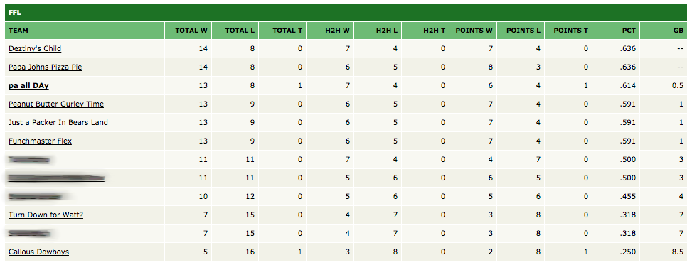

Fantasy Football Hybrid Standings
===========

How Do I Get it?
------
Download from the Chrome Web Store at:

https://chrome.google.com/webstore/detail/hybrid-fantasy-football-s/defieefkkhbdajheandkjdenpjolcpgd

Once installed, an options menu will appear. Go to your ESPN league that uses hybrid standings and copy the 'leagueId' from the URL and paste it in the input box on the options menu. Don't forget to save!

What is this?
------
This extension provides users with the ability to see the standings of their league on ESPN if their league uses a hybrid scoring system. No more do league managers have to keep track of this by hand or on the side, it's all taken care for you and now everyone in the league can see the hybrid standings straight from the ESPN Standings page!

Hybrid scoring is a combination of H2H and points based scoring that eliminates the luck of scheduling from the game. Every week you have the ability to get 2 wins. 1 win you get by winning your matchup. The second "win" you get if you finish the week in the top half of scores.  For example if you put up 110 and your opponent puts up 120, but your score of 110 would have beat anyone else that week you would go 1-1 that week while your opponent would go 2-0.

 It looks like this:

Future Ideas
------
* Color code standings to show who is in playoff contention, who has clinched, who is eliminated, etc.
* Make columns sortable
* Edit projected playoff bracket to reflect hybrid standings
* Yahoo compatible
* Update info that relies on scoring such as win streak
* Make alert to remind LM to adjust playoff schedule based on hybrid stndings

Known Issues
------
* If there is a more than 2-way tie for the 6th highest points it still gives all the people who tied .5 wins

Update Log
------
* v0.9.0 (8/4/2018) 
  * Added ability to set tie breaker criteria in the options menu of this extension.
* v0.8.0 (6/28/2018) 
  * Made extension work for 2018 season
* v0.7.0 (8/29/2017) 
  * Fixed bug: Hybrid standings were only showing after week 1 finished.
* v0.6.3 (8/27/2017) 
  * Fixed bug: Points For wasn't properly set for each team resulting in wrong tie-breakers.
* v0.6.0 (8/16/2017)
  * Made extension work for 2017 season
* v0.5.1 (12/8/2016)
  * Changed where Points W calculation was getting score from to handle corner case of a league using adjusted scores.
  * Fixed bug on certain pages in leagues using divisions where only one divisions team's would show hybrid standings.
* v0.5.0 (12/8/2016)
  * Fixed UI on finalstandings page
  * Fixed standings on leagueoffice page
* v0.4.1 (10/11/2016)
  * Added rankings to standings page.
* v0.4.0 (9/22/2016)
  * Added options menu to allow user to specify which of their leagues use hybrid standings.
* v 0.3.0 (9/20/2016)
  * New logo (thanks to Danny Eliahu)! Fixed bug where hybrid score was not displaying on 2nd owner of a matchup.
* v 0.2.0 (9/16/16)
  * hybrid record appears on all ESPN pages that display record (not just Standings page)
* v 0.1.4 (9/14/16)
  * changed name from Hybrid Fantasy Football Standings to Fantasy Football Hybrid Standings
* v0.1.3 (9/13/16)
  * GB works for multiple divisions
* v0.1 (9/13/16)
  * Initial release
 
Thanks
------
* Thanks to Brett Woodward's [FantasyPlus](https://github.com/flipperbw/FantasyPlus) and Thomas Beutler's [FantasyTargets](https://github.com/tcbeutler/FantasyTargets) for providing me with inspiration to build this and give back to the Fantasy community.
* Thanks to Danny Eliahu for the photoshop work and nice graphics!

Donations
------
* BTC: 17Rr3TcvafC4yfBJ4mvqMDq8C1RQGeEfFD
* ETH: 0xf6b1d2ed5282fa95a6e7e52b56f14b522a8d44c7
* LTC: Lej1QW7xvBbomeKQdGAW2ATDG8PwpEtDz7
